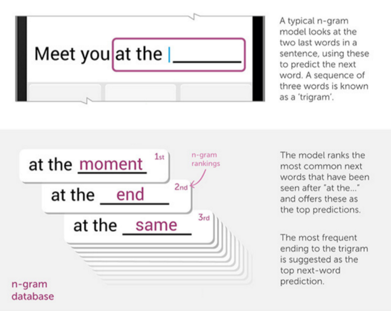
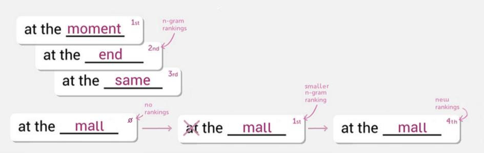

## Introduction 

The goal of this project it to create a **smart keyboard** similar to switfkey. 

It should be:

+ **fast**: the suggested words should appear as quickly as the user types
+ **accurate**: the user should only have to type a few letters per word - if at all
+ **mobile-first**: the app should work flawlessly in all screen sizes

I use a predictive model based on **n-gram frequencies** & **stupid backoff**, as explained in the next slides. 

The n-gram database is built from a **10 millions words corpus** coming from Twitter, blogs and news websites. 

N-grams that occur **less than 10 times** in the corpus **are discarded**. This considerably reduces the size of the database while ensuring optimum results.

--- .class #id 

## n-gram model

The n-gram model is explained nicely in this swiftkey [blog post](https://blog.swiftkey.com/neural-networks-a-meaningful-leap-for-mobile-typing/): 

--- .class #id 

## Stupid backoff

We want to calculate the ranking of as many words as possible, to ensure the **best possible prediction**. 

The [stupid backoff](http://www.aclweb.org/anthology/D07-1090.pdf) algorithm is used for sequences of words **not in the database** ("at the mall" in our example below): it looks at the word's ranking in a smaller sequence of words ("the mall") and applies a penalty to reflect its lower likelihood. 

In our example, "mall" is the most common word after "the", so it is ranked 1st. The penalty is applied and the final ranking of "mall" is 4th.

--- .class #id 

## App links & comments

The user is encouraged to **try the app on their mobile device**, in order to compare the suggested words with the phone's suggestions. It should work in all modern browsers (tested on Chrome/Firefox/Safari/Edge/IE11).

The shinyapp: https://splat.shinyapps.io/smartKeyboard. 

The sharp user will notice a significant delay between their input & the display of suggestions. It is due to the latency between the server & the browser. 

Another, faster version is available here: https://enigmatic-coast-42463.herokuapp.com. 

It takes a bit longer to load, but it is **much faster** as all calculations are done client-side in javascript.

